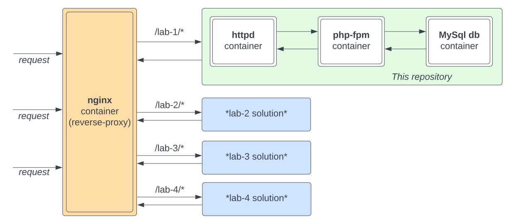
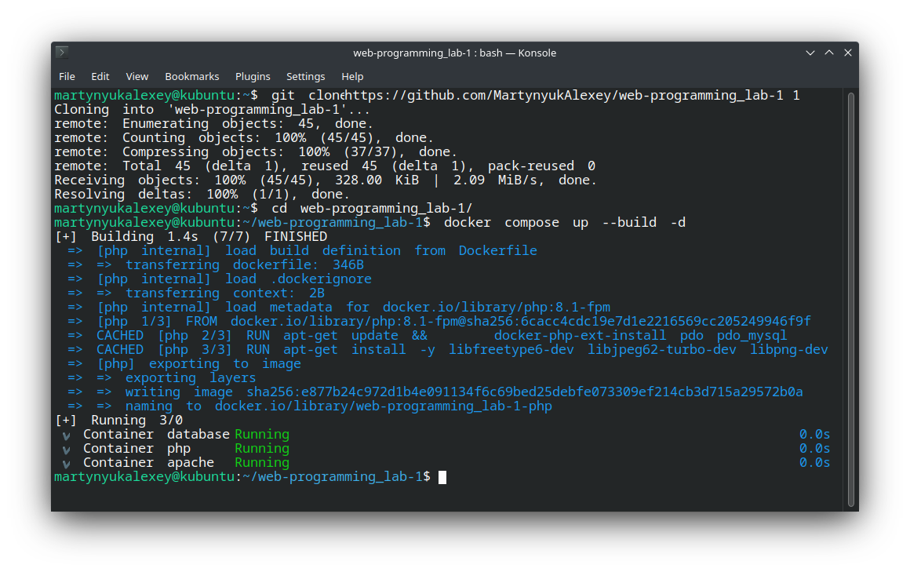
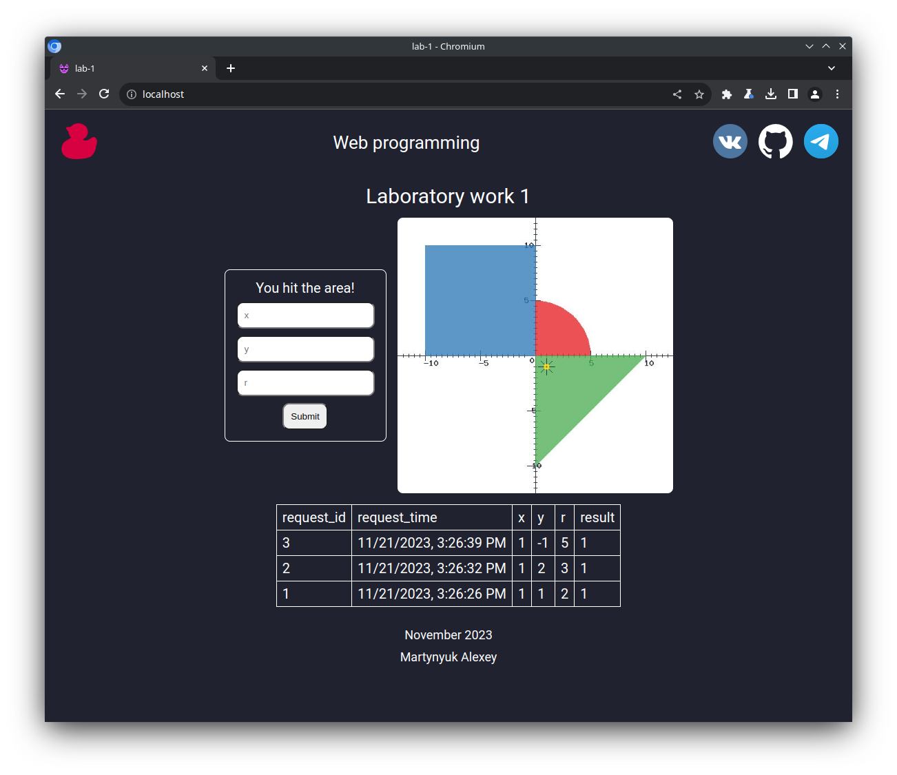

# web-programming_lab-1

## Локальный запуск

Клонируем репозиторий и выполняем `docker compose up --build -d`:

После проект станет доступен на `localhost`:

## Вопросы к защите лабораторной работы

1. Протокол HTTP. Структура запросов и ответов, методы запросов, коды ответов сервера, заголовки запросов и ответов.
1. Язык разметки HTML. Особенности, основные теги и атрибуты тегов.
1. Структура HTML-страницы. Объектная модель документа (DOM).
1. HTML-формы. Задание метода HTTP-запроса. Правила размещения форм на страницах, виды полей ввода.
1. Каскадные таблицы стилей (CSS). Структура - правила, селекторы. Виды селекторов, особенности их применения. Приоритеты правил. Преимущества CSS перед непосредственным заданием стилей через атрибуты тегов.
1. LESS, Sass, SCSS. Ключевые особенности, сравнительные характеристики. Совместимость с браузерами, трансляция в "обычный" CSS.
1. Клиентские сценарии. Особенности, сферы применения. Язык JavaScript.
1. Версии ECMAScript, новые возможности ES6 и ES7.
1. Синхронная и асинхронная обработка HTTP-запросов. AJAX.
1. Библиотека jQuery. Назначение, основные API. Использование для реализации AJAX и работы с DOM.
1. Реализация AJAX с помощью SuperAgent.
1. Серверные сценарии. CGI - определение, назначение, ключевые особенности.
1. FastCGI - особенности технологии, преимущества и недостатки относительно CGI.
1. Язык PHP - синтаксис, типы данных, встраивание в веб-страницы, правила обработки HTTP-запросов. Особенности реализации принципов ООП в PHP.
